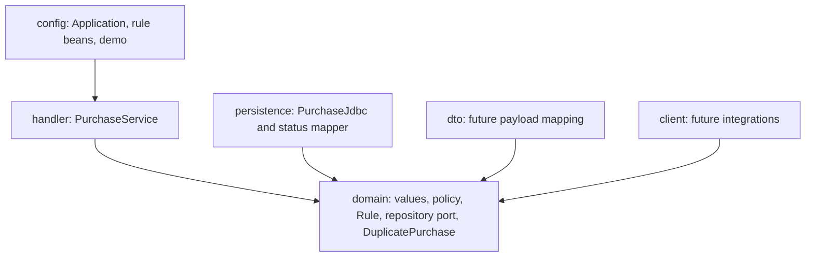

# Purchase Tracker — Lab 3

Purchase requests move from drafting through approval to ordering. This is the same semester product as Labs 1 and 2. Lab 3 adds PostgreSQL persistence, a mocked outbound port, and transaction tests.

## Requirements

- JDK 21 and Maven 3.9 or later.
- PostgreSQL 16 (the provided Compose file starts only the database).
- Docker with Compose for the commands below, or an existing local PostgreSQL installation.
- Run commands from the folder containing `pom.xml`.

## Quick start

For a new checkout:

```sh
git clone --branch lab-3 https://github.com/argymakmyrzaliyev-star/purchase-tracker.git
cd purchase-tracker
docker compose up -d --wait
mvn -q verify
mvn spring-boot:run "-Dspring-boot.run.profiles=demo"
```

The demonstration prints:

```text
ROLLBACK count = 0
COMMITTED count = 1
LAB 3 DEMO PASSED
```

It uses fresh business keys on every run. The failed transaction leaves no rows; the first successful registration stays in the database. Each demo run deliberately adds one committed example purchase.

For a normal startup without example purchases:

```sh
mvn spring-boot:run
```

The hand-written `src/main/resources/db/schema.sql` is applied at startup. The app prints `Started Application` and exits normally because it has no web server or background work. No application container is built.

Stop the database with `docker compose stop`. The named volume retains its data.

## Database connection

The classroom defaults are PostgreSQL at `localhost:5432/css`, username `css`, password `css`. They are local teaching credentials. An existing local PostgreSQL instance must have this database and role, with permission to create tables and the test schema.

Override the connection with `DB_URL`, `DB_USERNAME`, and `DB_PASSWORD`, or Spring's standard `SPRING_DATASOURCE_*` environment variables. Keep personal/cloud credentials out of Git.

The tests use the separate `purchase_tracker_lab3_test` schema in the same database. They rebuild its `purchase_request` table before each database test; the application's `public.purchase_request` table is left intact. Run one verification process at a time against that test schema.

## Week 5: prove rollback in psql first

Start PostgreSQL, then apply the same SQL and run the rollback script:

```sh
docker compose up -d --wait
docker compose exec -T postgres psql -U css -d css -v ON_ERROR_STOP=1 -f /lab/schema.sql
docker compose exec -T postgres psql -U css -d css -f /demo/rollback-demo.sql
```

The script performs `BEGIN`, inserts a fresh key twice, checks the expected SQLSTATE `23505`, explicitly issues `ROLLBACK`, and verifies count **0**. The duplicate-key error is expected. Success ends with:

```text
PSQL ROLLBACK PASSED: SQLSTATE 23505; count = 0
```

With a local PostgreSQL installation, run the same files using `psql -h localhost -U css -d css -f <file>`; enter the local password when prompted.

## Identifiers and schema

| Value | Java type | PostgreSQL column | Purpose |
| --- | --- | --- | --- |
| Internal identity | `PurchaseId(UUID)`, created by `newId()` | `id uuid PRIMARY KEY` | Stable surrogate key |
| Human number | `PurchaseKey(String)`, e.g. `PR-19` | `business_key text NOT NULL UNIQUE` | Number shown to people |
| Status | `PurchaseStatus` | `status text NOT NULL` with `CHECK` | DRAFT / APPROVED / ORDERED |
| Description | Validated nonblank title | `title text NOT NULL` | Purchase details |
| Creation time | Database default | `created_at timestamptz NOT NULL DEFAULT now()` | Creation timestamp |

Lab 1's human string identifier and its null/blank validation now live in `PurchaseKey`; `PurchaseId` is the separate UUID identity required by Lab 3. No database from an earlier lab needed migration.

There is one application table, `purchase_request`. Both the manual psql demonstration and Spring execute the same hand-written `schema.sql`. `IF NOT EXISTS` permits repeat startup; tests drop their isolated table first to validate creation from scratch.

## Purchase status rules

These are the four rows retained in `PurchasePolicyTest` with `@ParameterizedTest` and `@CsvSource`.

| From | To | Result | Business reason |
| --- | --- | --- | --- |
| `DRAFT` | `APPROVED` | Allowed | A manager approves the request. |
| `APPROVED` | `ORDERED` | Allowed | The approved request can be sent to a supplier. |
| `DRAFT` | `ORDERED` | Forbidden | The request cannot bypass manager approval. |
| `ORDERED` | `DRAFT` | Forbidden | A supplier order cannot be reopened as a draft. |

Allowed moves return the target status; forbidden moves throw `IllegalStateException`. The SQL `CHECK` uses the same three statuses. Database mapping rejects unknown text rather than inventing a status.

## Package boundaries

Arrows show dependencies toward the domain:



- `PurchaseService` receives `Rule` and the `PurchaseRepository` outbound port through its constructor.
- `PurchaseRulesConfiguration` wires `UnapprovedCannotOrder` and `TransitionRule`.
- `PurchaseJdbc` implements the port with `JdbcTemplate`; INSERT, count, and lookup use `?` parameters.
- The persistence adapter translates PostgreSQL unique violations into unchecked `DuplicatePurchase`. Other integrity failures are not mislabeled as duplicate keys.
- `@Transactional` is on service methods. The service class is not final so Spring can proxy it.
- The domain contains no Spring or JDBC dependencies. All SQL and row mapping stay in `persistence`.

## Two transaction boundaries, two different counts

| Operation | Transactions | Failure | Committed count |
| --- | --- | --- | --- |
| `service.insertTwice(key)` | One transaction contains both INSERTs | Second INSERT throws `DuplicatePurchase`; the exception escapes | **0** |
| `service.register(id1, key, title)`, then a second registration | One transaction per external service call | First call commits; second call rolls back | **1** |

The repository never deletes the first row to hide a duplicate. No test class or method uses a transactional test wrapper. The two key tests query the result through an independent autocommit JDBC connection after the service returns or throws.

## Verification

```sh
mvn -q verify
```

Use `mvn verify` to display the full test summary and `BUILD SUCCESS`.

| Test | Evidence |
| --- | --- |
| `PurchasePolicyTest` | Four README rows plus other forbidden transitions and null statuses |
| `PurchaseIdTest` / `PurchaseKeyTest` | UUID identity and rejected null/blank identifiers |
| `PurchaseServicePortTest` | Mocked outbound repository; no database or HTTP calls |
| `PurchaseServiceTest` | Spring injects the rule chain and preserves Lab 2 behavior |
| `PurchaseJdbcIntegrationTest.secondStatementRollsBack` | Duplicate domain exception, SQLSTATE 23505, committed count 0 |
| `PurchaseJdbcIntegrationTest.secondRequestKeepsTheFirst` | First row commits, second call fails, count 1, original data unchanged |
| Remaining JDBC / mapper tests | PostgreSQL CHECK and NOT NULL, all statuses round-trip, unknown values rejected, quoted inputs remain data |

GitHub Actions uses Java 21 and real PostgreSQL. It checks domain boundaries, executes the psql rollback demonstration, runs `mvn -q verify`, and starts the Java demonstration. Test reports and demo logs are saved in the `lab3-verification` workflow artifact.

## Hand-in

| Lab | Branch | Pull request |
| --- | --- | --- |
| Lab 2 — Spring Boot and domain rules | [lab-2](https://github.com/argymakmyrzaliyev-star/purchase-tracker/tree/lab-2) | [PR #1](https://github.com/argymakmyrzaliyev-star/purchase-tracker/pull/1) |
| Lab 3 — PostgreSQL, JDBC and transactions | [lab-3](https://github.com/argymakmyrzaliyev-star/purchase-tracker/tree/lab-3) | [PR #2](https://github.com/argymakmyrzaliyev-star/purchase-tracker/pull/2) |

Lab 2 contains the Spring Boot version without database persistence. Lab 3 continues that product with PostgreSQL and JDBC. Its PR compares against `lab-2`; after Lab 2 is merged, the Lab 3 PR can target `main`.

The Lab 3 PR title must include the actual Jira story key supplied by the team. The course number is not evidence of a Jira story.

