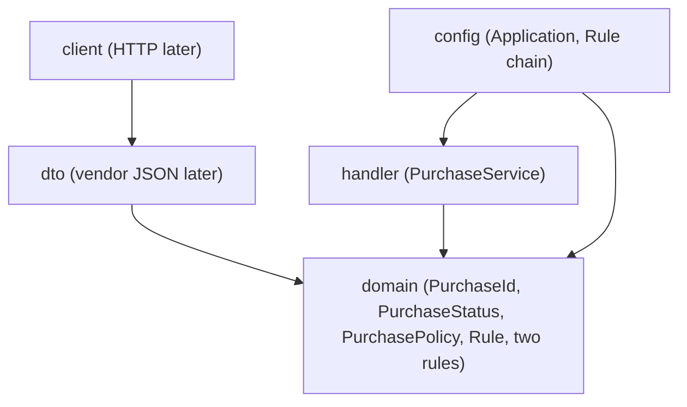

# Purchase Tracker

We build a purchase request tracker. People track purchase requests from drafting through manager approval to ordering. This is the same product theme as Lab 1, now joined to Spring Boot for Lab 2.

## Requirements

- JDK 21
- Maven 3.9 or later

## Run and verify

From the repository root:

```sh
mvn -q verify
mvn spring-boot:run
```

The application starts without opening a web server. A successful launch prints `Started Application`; the process then exits normally because this lab has no web server or background work. No REST API, database, or Docker setup is included.

GitHub Actions runs `mvn -q verify` and then launches the application separately with `mvn -B --no-transfer-progress spring-boot:run`. The startup check requires both a successful exit and the `Started Application in` log message.

## Package boundaries

Arrows point inward: outer packages may depend on `domain`; domain does not depend on Spring or on outer packages.



`dto` and `client` are placeholders for later integration work. `handler` contains `PurchaseService`; no HTTP client or REST endpoint is implemented in this lab. The rule types and policy are plain Java and contain no `org.springframework` imports.

## Purchase status rules

| From | To | Result | Business reason |
| --- | --- | --- | --- |
| `DRAFT` | `APPROVED` | Allowed | A manager approves the request. |
| `APPROVED` | `ORDERED` | Allowed | The approved request can be sent to a supplier. |
| `DRAFT` | `ORDERED` | Forbidden | The request cannot bypass manager approval. |
| `ORDERED` | `DRAFT` | Forbidden | An order sent to a supplier cannot be reopened as a draft. |

`PurchaseService` is a Spring `@Service` that receives the `Rule` chain through its constructor. `PurchaseRulesConfiguration` wires two domain rule implementations: `UnapprovedCannotOrder` is the stop-factor, and `TransitionRule` enforces the full status table. `PurchasePolicy` calls the injected chain and remains framework-independent.

## Pull request

Lab 2 is submitted through [pull request #1](https://github.com/argymakmyrzaliyev-star/purchase-tracker/pull/1) from `CSS-3008-join-spring-boot` into `main`. The title must contain the exact Jira story key supplied by the team.

Paste this checklist into the PR body:

- [ ] Story IDs are in the title
- [ ] Same product as Lab 1
- [ ] `domain` has no `org.springframework` import
- [ ] Two types implement `Rule`
- [ ] `mvn -q verify` is green
- [ ] `mvn spring-boot:run` starts
- [ ] No secrets, `.env`, or `target/` committed

Mark the checklist items in the PR body after verifying them. The GitHub Actions run for the latest PR commit provides evidence for both Maven commands on Java 21.
