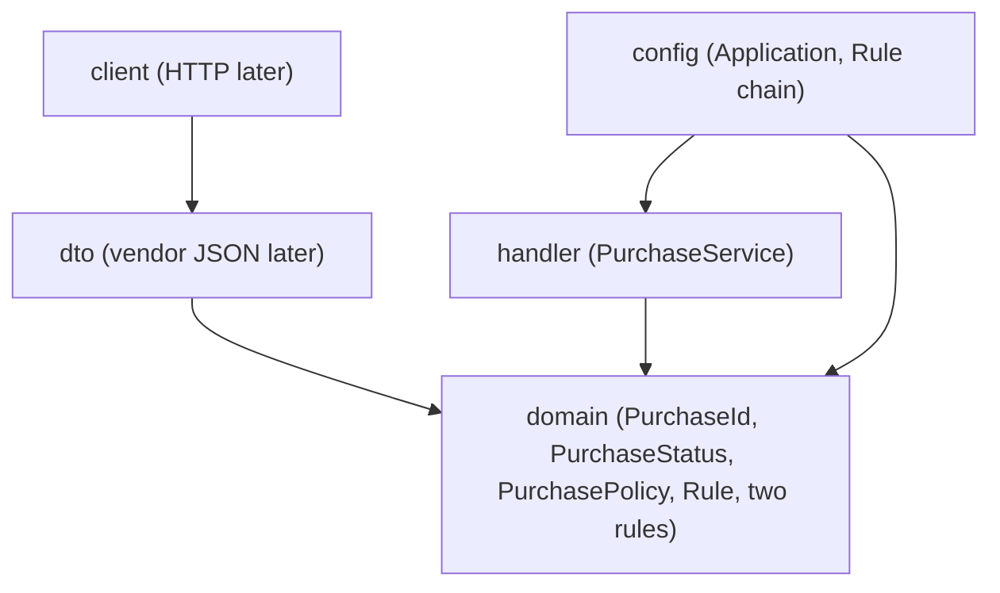

# Purchase Tracker

We build a purchase request tracker. People track purchase requests from drafting through manager approval to ordering. This is the same product theme as Lab 1, now joined to Spring Boot for Lab 2.

## Requirements

- JDK 21
- Maven 3.9 or later

## Run and verify

From the repository root:

```sh
mvn -q verify
mvn spring-boot:run
```

The application starts without opening a web server. This lab has no REST API, database, or Docker setup. Stop the process with `Ctrl+C`.

## Package boundaries

Arrows point inward: outer packages may depend on `domain`; domain does not depend on Spring or on outer packages.



`dto`, `client`, and `handler` are reserved for later integration work where noted; no HTTP client or REST endpoint is implemented in this lab. The rule types and policy are plain Java and contain no `org.springframework` imports.

## Purchase status rules

| From | To | Result | Business reason |
| --- | --- | --- | --- |
| `DRAFT` | `APPROVED` | Allowed | A manager approves the request. |
| `APPROVED` | `ORDERED` | Allowed | The approved request can be sent to a supplier. |
| `DRAFT` | `ORDERED` | Forbidden | The request cannot bypass manager approval. |
| `ORDERED` | `DRAFT` | Forbidden | An order sent to a supplier cannot be reopened as a draft. |

`PurchaseService` is a Spring `@Service` that receives the `Rule` chain through its constructor. `PurchaseRulesConfiguration` wires two domain rule implementations: `UnapprovedCannotOrder` is the stop-factor, and `TransitionRule` enforces the full status table. `PurchasePolicy` calls the injected chain and remains framework-independent.

## Pull request

Use the Jira story ID supplied by your team in the PR title, for example `CSS-18 join Spring Boot to Purchase Tracker`. Do not guess or invent a story ID.

Paste this checklist into the PR body:

- [ ] Story IDs are in the title
- [x] Same product as Lab 1
- [x] `domain` has no `org.springframework` import
- [x] Two types implement `Rule`
- [ ] `mvn -q verify` is green
- [ ] `mvn spring-boot:run` starts
- [x] No secrets, `.env`, or `target/` committed

Before opening the PR, run both commands above on JDK 21 and check off the two local-run items.
